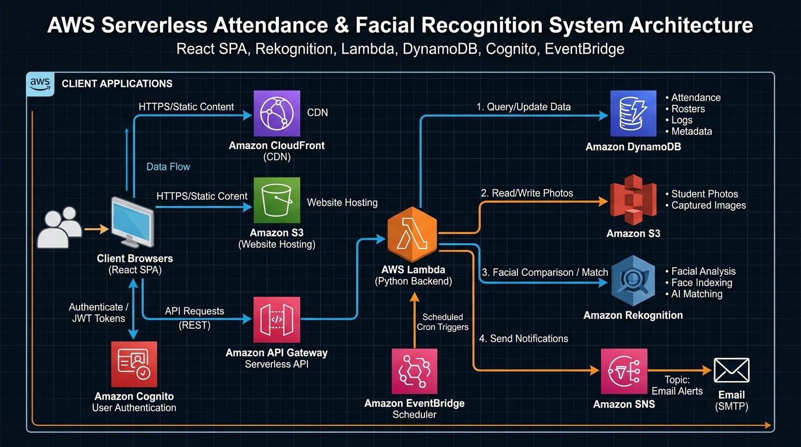
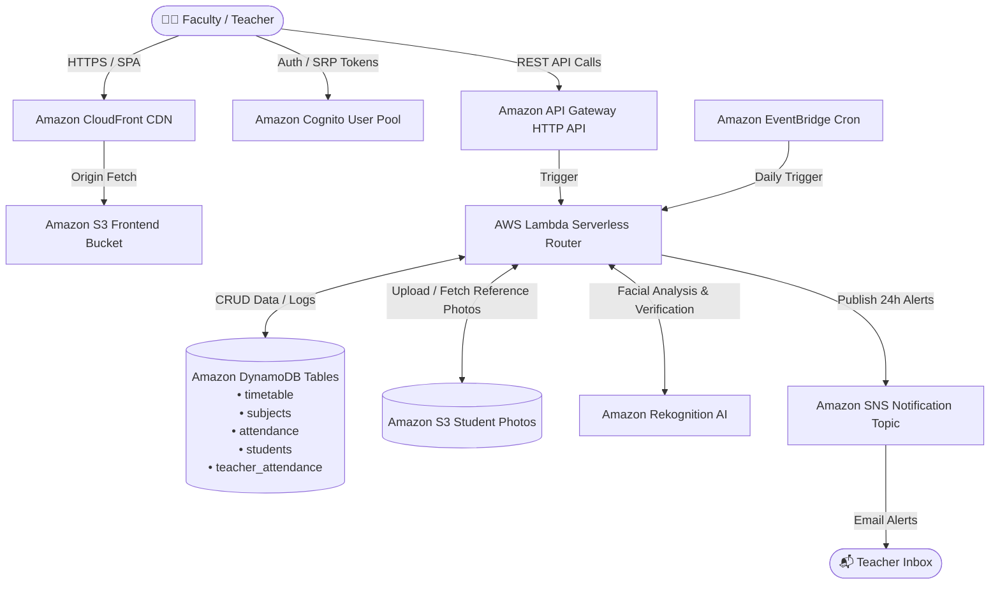

# 📋 Presently — AWS Serverless AI Facial Recognition Attendance Platform

[](https://d1yszng57r6fz7.cloudfront.net)
[-blue?logo=awslambda)](https://aws.amazon.com/lambda/)
[](https://aws.amazon.com/rekognition/)
[](https://www.terraform.io/)
[](https://reactjs.org/)

**Presently** is a production-grade, serverless attendance and classroom management platform built on **AWS Free Tier** architecture and provisioned with **Terraform (Infrastructure as Code)**. It combines real-time webcam capture and **Amazon Rekognition AI** face verification with automated master timetable scheduling, student enrollment management, and **Amazon SNS** notification reminders.

---

## 🌐 Live Production Deployments

| Component | AWS Resource / Endpoint |
| :--- | :--- |
| **CloudFront Web App** | 🔗 **[https://d1yszng57r6fz7.cloudfront.net](https://d1yszng57r6fz7.cloudfront.net)** |
| **API Gateway Endpoint** | `https://5pezi90imf.execute-api.ap-south-1.amazonaws.com/` |
| **Cognito User Pool ID** | `ap-south-1_q5rQZYWij` (Client: `4qcafv5s880bu4ujfg42m30o8g`) |
| **AWS Region** | `ap-south-1` (Mumbai) |
| **Photos Storage S3 Bucket** | `attendance-system-photos-5c2c7946` |
| **Frontend S3 Bucket** | `attendance-system-frontend-5c2c7946` |
| **SNS Topic ARN** | `arn:aws:sns:ap-south-1:851188704481:attendance-system-attendance-reminders` |

---

## 🏛️ System Architecture



### Architectural Data Flow:


---

## ✨ Core Features

### 1. 🤖 AI Facial Recognition Attendance (Amazon Rekognition)
- **Live Webcam Verification**: Captures snapshots via HTML5 video/canvas in the browser and sends them to AWS Lambda.
- **Reference Face Comparison**: Compares against reference photos in Amazon S3 with an 85%+ similarity threshold.
- **1-Click Reference Registration**: Direct face enrollment modal allows teachers to enroll a student's master face profile with 1 click.
- **Teacher Check-in Safeguard**: Teacher identity verification unlocks student marking for the active period.

### 2. 📅 Master Timetable Grid Scheduling
- Interactive **5-Day Order × 11-Period Schedule Matrix**.
- Real-time slot allocation with room numbers, buildings, subjects, and sections.
- Quick period filtering for today's active schedule.

### 3. 👥 Student Roster & Dynamic Subject Enrollment
- Teachers add students with **Full Name, Email, Roll Number, Section, and Department**.
- Selective subject enrollment assigns students to specific classes.
- Real-time margin calculations, attendance percentages, and critical shortage alerts (e.g. `< 75%`).

### 4. ⚙️ Course Criteria & Subject Settings
- Customizable attendance thresholds (e.g. 75% or 80%) per subject.
- Configurable edit windows (e.g. 10 days) to prevent retroactive tampering.

### 5. 🔔 Automated 24-Hour Unmarked Class Reminders (Amazon SNS)
- EventBridge-triggered automated checks for unmarked classes.
- In-app notification badge in the top navigation bar with instant manual SNS publish triggers.

### 6. 👤 Live Display Name Customization
- Integrated profile modal allows faculty to update their displayed name anywhere across the header, sidebar, and dashboard in real-time.

---

## ☁️ AWS Services & Free Tier Breakdown

| AWS Service | Role in Architecture | Free Tier Allowance |
| :--- | :--- | :--- |
| **AWS Lambda** | Python 3.12 Serverless API Handlers | Always Free: 1,000,000 requests/month |
| **Amazon DynamoDB** | 5 NoSQL tables for metadata, rosters & logs | Always Free: 25 GB storage + 25 RCU/WCU |
| **Amazon Cognito** | Secure faculty authentication & JWTs | Always Free: 50,000 Monthly Active Users |
| **Amazon CloudFront** | Global edge HTTPS CDN caching | Always Free: 1 TB data transfer out/month |
| **Amazon S3** | Static web hosting & private photos storage | 12-Month Free: 5 GB storage |
| **Amazon API Gateway** | Low-latency HTTP API routing | 12-Month Free: 1,000,000 API calls/month |
| **Amazon SNS** | Push email alerts & reminders | Always Free: 1,000,000 publishes/month |
| **Amazon Rekognition**| AI Facial verification & comparison | Free Tier trial & pay-per-use scaling |

---

## 📁 Repository Structure

```
Attendance-System-VibeCoding/
├── terraform/                      # Infrastructure as Code (Terraform)
│   ├── main.tf                     # AWS provider & backend definition
│   ├── cognito.tf                  # Cognito User Pool & App Client
│   ├── dynamodb.tf                 # 5 DynamoDB NoSQL tables
│   ├── lambda.tf                   # Lambda function packaging & IAM roles
│   ├── api_gateway.tf              # HTTP API Gateway routes & CORS
│   ├── s3.tf                       # S3 Buckets & auto-upload configuration
│   ├── cloudfront.tf               # CloudFront CDN distribution
│   ├── sns.tf                      # SNS topic & EventBridge cron rules
│   └── outputs.tf                  # Output endpoints & resource IDs
├── backend/                        # Serverless Python Lambda backend
│   └── handlers/
│       ├── main.py                 # Central HTTP router & CORS handler
│       ├── face_recognition.py     # AWS Rekognition & S3 photo verification
│       ├── attendance.py           # Class attendance sessions & queries
│       ├── students.py             # Student roster CRUD & management
│       ├── subjects.py             # Subject criteria & enrollment
│       ├── timetable.py            # Timetable matrix schedule
│       ├── teacher_attendance.py   # Faculty check-in verification
│       └── notifications.py        # SNS alert publisher
├── frontend/                       # React 19 + Vite Single Page App
│   ├── src/
│   │   ├── components/
│   │   │   ├── Auth/               # Faculty LoginPage
│   │   │   ├── Layout/             # Sidebar, Header, Profile Modal
│   │   │   └── Teacher/            # Dashboard, Timetable, Attendance, Roster, Settings
│   │   ├── context/                # AuthContext (Cognito + Session fallback)
│   │   ├── services/               # api.js & auth.js
│   │   └── config.js               # Cloud endpoints configuration
│   ├── package.json
│   └── vite.config.js
├── docs/                           # Documentation assets
│   └── aws_architecture_diagram.png# High-resolution AWS architecture diagram
└── scripts/
    └── deploy_frontend.js          # S3 upload & CloudFront cache invalidator
```

---

## 🚀 Quick Start & Local Development

### 1. Prerequisites
- **Node.js**: v18+ or v20+
- **Python**: 3.10+
- **Terraform**: v1.5+
- **AWS CLI**: configured with active credentials

### 2. Local Frontend Setup
```bash
cd frontend
npm install
npm run dev
```
Open **`http://localhost:5173/`** in your browser.

---

## 🛠️ Deployment & Cloud Synchronization

### Deploying Infrastructure & Backend (Terraform)
```bash
cd terraform
terraform init
terraform apply -auto-approve
```

### Deploying Frontend to S3 & Invalidating CloudFront Cache
```bash
cd frontend
npm run deploy
```
*(Automatically compiles `vite build`, uploads bundles to S3, and clears the CloudFront cache across all edge locations).*

---

## 🔐 Security & Best Practices
- **Least Privilege IAM**: Lambda execution roles are strictly scoped to project DynamoDB tables, S3 photo prefixes, and SNS topic ARNs.
- **Encrypted Traffic**: Enforced HTTPS encryption via CloudFront SSL certificates and API Gateway SSL endpoints.
- **Zero Secrets in Repository**: No private keys or secret access credentials committed to version control.
- **SPA Error Fallbacks**: Custom CloudFront 403/404 response routing maps directly to `index.html` for clean client-side routing.

---

## 📜 License
This project is open-source and available under the [MIT License](LICENSE).
